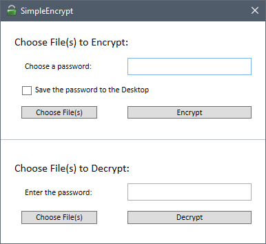

# SimpleEncrypt

## How to use:
- Just compile the solution and run the file.
- Target framework: .Net 4.5.2

## Features
- Using AES algorithm for encryption.
- You can save the chosen password by checking the checkbox. The password will be saved on your Desktop.

## ToDo:
- [ ] Adding the same implementation using RSA algorithm.
- [ ] Adding support for large files.
- [ ] Run the process multi-threaded for larger files.
- [ ] Adding the Server.

## Security warnings
- **You are responsible for your own actions.** Use this code at your own risk. *changing the code or picking the wrong file can harm your computer.*
- This software is open sourced under a [GNU Lesser General Public License license](https://www.gnu.org/licenses/lgpl-3.0.en.html).

### FOR EDUCATIONAL USE ONLY
- All passwords used in SimpleEncrypt is `password`
- Do not use any part of this code as a Ransomware.
